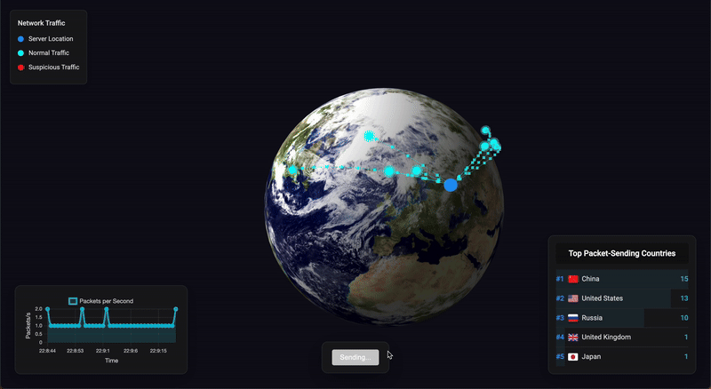

# Network Traffic Visualisation

A real-time 3D visualisation of network traffic using Three.js and Flask framework. The application displays network packets traveling across a globe.



## Start

1. Clone the repository:
```bash
git clone <repository-url>
cd traffic-visualisation
```

3. Build and start all services:
```bash
docker-compose up --build
```

4. Access the application:
   - Frontend: http://localhost
   - Server API: http://localhost:1337
   - Sender API: http://localhost:1338

5. Click "Start Sending Packets" to begin the visualization

### *Note on Visualization*

The Three.js visualization may occasionally experience delays. If packets don't appear immediately after clicking "Start Sending Packets", please wait a few moments. The system will continue to process data in the background and visualization should resume shortly.


## Project description

The project consists of three main components:

1. **Frontend(Port 80)**
   - Three.js for 3D visualisation
   - Chart.js for performance graphs

2. **Server (Port 1337)**
   - Handles packet data collection
   - Provides data to the frontend

3. **Sender (Port 1338)**
   - Simulates network traffic
   - Sends packet data to the server

## Development
To modify the visualisation:

1. Frontend files:
   - `js/visualisation.js` - 3D visualisation logic
   - `js/chart-setup.js` - Performance graphs
   - `js/data-handling.js` - Data processing
   - `styles/main.css` - Styling

2. Backend files:
   - `server.py` - Main server implementation
   - `sender.py` - Traffic simulation
   - `settings.py` - Configuration

## Troubleshooting
1. If services fail to start:
   ```bash
   docker-compose down
   docker-compose up --build
   ```

2. Connection issues:
   - Check if ports 1337 and 1338 are available
   - Verify Docker network is created
   - Check service logs: `docker-compose logs`
